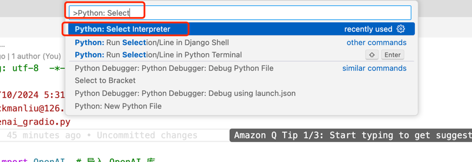
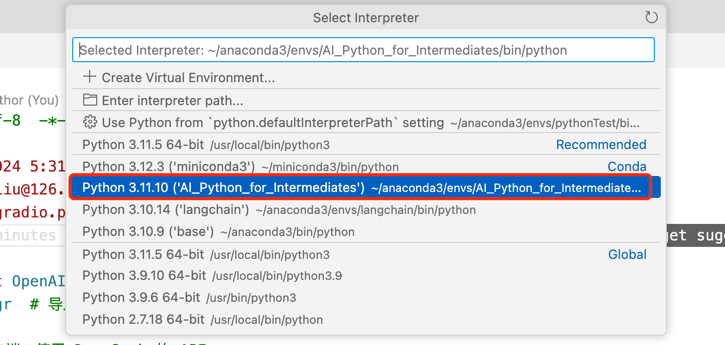
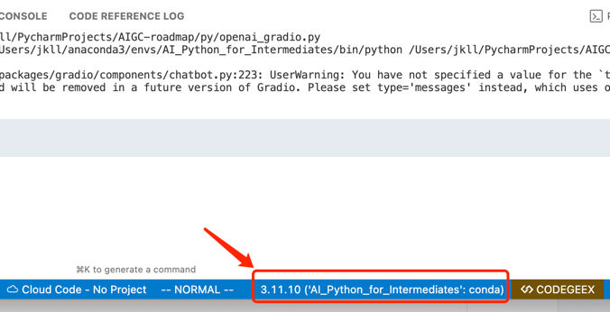
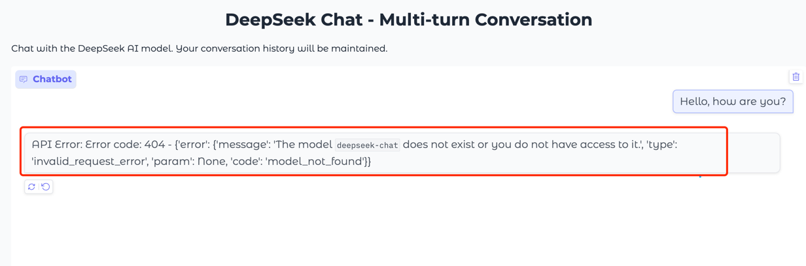
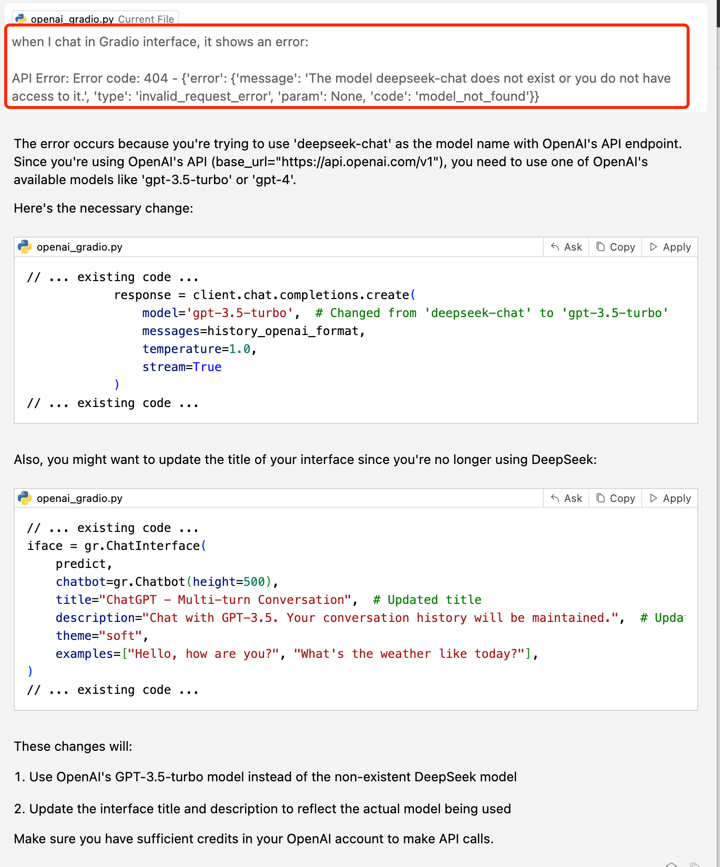
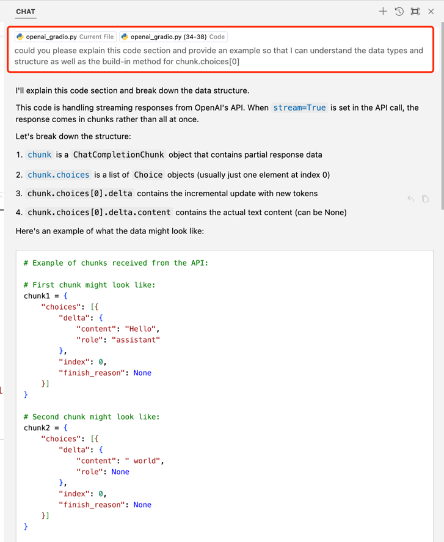
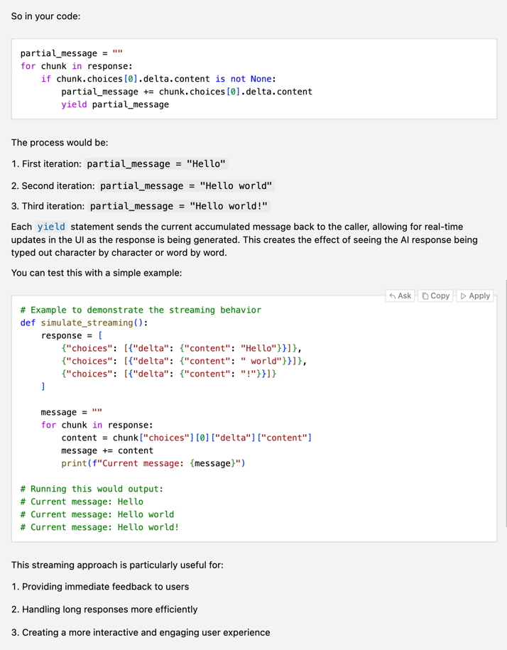

## 1. 安装 cursor，切换 Python 运行环境为 AI_Python_for_Intermediates 运行 “示例代码”
### option 1:
_Using Command Palette_
- _Cmd+Shift+P (Mac) or Ctrl+Shift+P (Windows/Linux)_
- _Type "Python: Select Interpreter"_
- _Select "AI_Python_for_Intermediates"_

### option 2:
_Using Status Bar_
- _Click on the Python version shown in the bottom status bar_
- _Select your desired interpreter from the dropdown list_

## 2. 根据运行的报错通过 cursor 完善代码或安装缺失的第三方库
**_API Error_**

**_Modify the code according to cursor's suggestions_**

## 3. 通过大模型 (后续简称为 LLM) 的对话，结合官方文档，理解 LLM 单轮对话与多轮对话的差异
_In terms of technology, multi-turn conversations in AI chatbots or virtual assistants require more sophisticated natural language processing to maintain context and coherence over several exchanges, whereas single-turn conversations are simpler since they only require responding to isolated queries._

## 4. 通过 LLM 解释语句 “chunk.choices[0]” 的功能，并编写调试程序，直到你能够理解该用法使用的数据类型、数据类型内置的方法
**_sent the query to cursor chat and got the following response:_**

