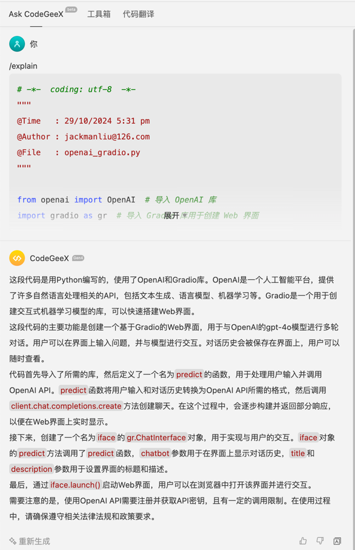
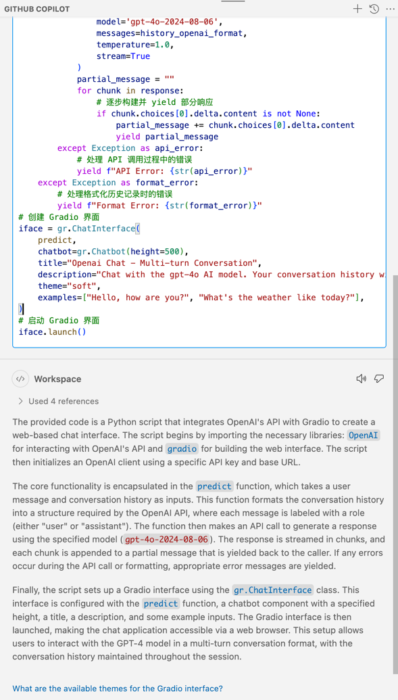
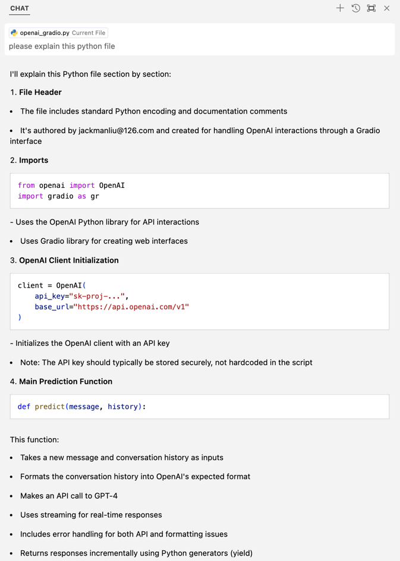
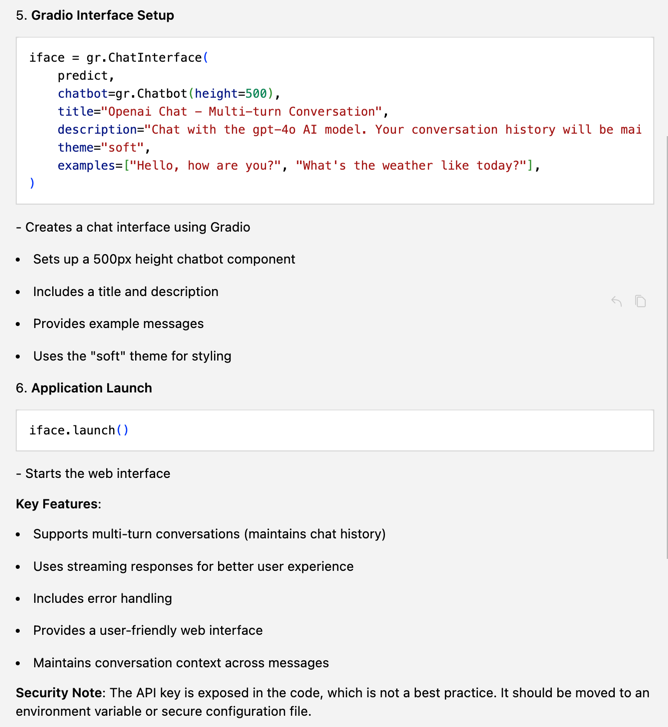
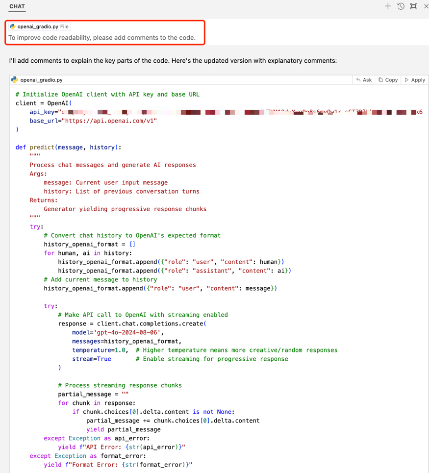
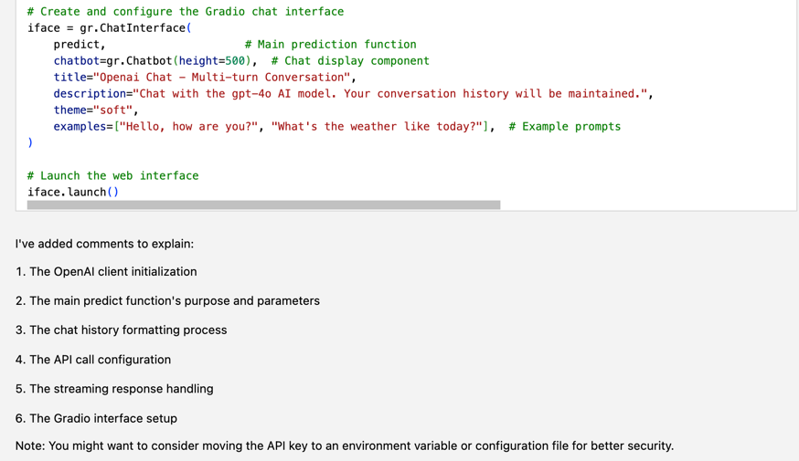

## 1. 为 cursor 安装 LLM code 插件，如：Github Copilot、MarsCode 等，对代码功能进行分析，比较不同模型的回复效果
**_CodeGeeX_**

**_GitHub Copilot_**

**_cursor_**

**_For the same prompt, the responses from CodeGeeX and GitHub Copilot are similar, while the response from Cursor is more detailed, explaining the functionality and usage of the code._**

## 2. 以“示例代码” (或你的主力语言) 为基础，使用 LLM 代码解释功能，为你的代码增加注释
**_generate comments with cursor chat_**

